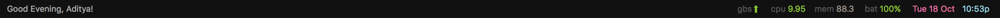

# nerdbar.widget



Übersicht system information bar. Inspired by screenshots of the [kwm window manager](https://github.com/koekeishiya/kwm) and the [authors' NerdTool configuration](https://github.com/koekeishiya/kwm/issues/8#issuecomment-166608067).

Included widgets:

* Battery status
* CPU usage
* Date + Time
* Memory usage
* Slack unread + highlighting for direct messages

Also included is an data usage checker for Airtel which obviously is only useful if Airtel is your ISP. You can disable it by deleting the file.

## Installation

Make sure you have [Übersicht](http://tracesof.net/uebersicht/) installed.

Then clone this repository.

```bash
git clone https://gitlab.com/adityavm/ubersicht-widgets.git $HOME/Library/Application\ Support/Übersicht/widgets/nerdbar.widget
```

Also needs a `./lib/cfg.js` to run the Slack widget. The config should be defined as:

```javascript
var cfg = {
	SLACK_TOKEN: "xxxxxxxxx...",	// get one from https://api.slack.com/docs/oauth-test-tokens
	RETRY_INTERVAL: 15000, 				// time in milliseconds to wait before retrying connection,
	DEAD_TIMER: 120000,						// milliseconds to wait before marking connection as dead
	CHANNELS: ["xxx", "yyy"],			// channels you want to be notified for
	TYPES: ["aaa", "bbb"] 				// types of rooms to mark as very important ("im", "channel", "group")
};
```

## Dependencies

bitbar-plugins . usage.js

## Credits

* Original widget by [herrbischoff](https://github.com/herrbischoff)
* CSS Icons by [wentin](https://github.com/wentin/cssicon)