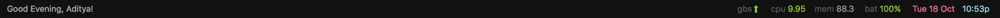

# nerdbar.widget



Übersicht system information bar for use with kwm window manager. Inspired by screenshots of the [kwm window manager](https://github.com/koekeishiya/kwm) and the [authors' NerdTool configuration](https://github.com/koekeishiya/kwm/issues/8#issuecomment-166608067).

## Installation

Make sure you have [Übersicht](http://tracesof.net/uebersicht/) installed.

Then clone this repository.

```bash
git clone https://gitlab.com/adityavm/ubersicht-widgets.git $HOME/Library/Application\ Support/Übersicht/widgets/nerdbar.widget
```

Also needs a `lib/cfg.js` to run the Slack widget. The config should be defined as:

```javascript
var cfg = {
	SLACK_TOKEN: "xxxxxxxxx...", // get one from https://api.slack.com/docs/oauth-test-tokens
	SLACK_SELF_ID: "yyyyyyyy",
	RETRY_INTERVAL: 15000, // time in milliseconds to wait before retrying connection
}
```

## Dependency

bitbar-plugins . usage.js

## Credits

Original widget by [herrbischoff](https://github.com/herrbischoff)
CSS Icons by [wentin](https://github.com/wentin/cssicon)